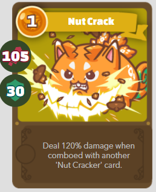

# Introducción
Bueno empecé a escribir esta guía por varios motivos, podríamos resumirlos en:
1) Una forma POTENCIAL de generar ingresos extra (variables, a desarrollar).
2) Con suerte, generar interés para que los interesados en el punto anterior se interioricen un poco más en blockchain y cryptos.
3) Intentar lograr los 2 puntos anteriores, explicando de la forma más simple que me salga.

La idea de esto es una guía gratuita y en español, democratizar conocimiento y transmitir lo que yo leí, averigüé y entendí del juego. Un par de amigos me sugirieron aceptar "donaciones", si alguien quiere hacerlo, dejo la wallet abajo (es una Ethereum wallet).

:warning: **DISCLAIMER 1:** No soy pro player de este juego, y la información de esta guía puede estar errada. De nuevo, es como yo entendí y procesé la información. Cualquier corrección es bienvenida.

:warning: **DISCLAIMER 2:** Toda la información de esta guía (salvo actualizaciones eventuales) es en base al contexto del momento en que se creó (22 de Junio, 2021).

:warning: **DISCLAIMER 3:** Voy a intentar usar la terminología en inglés lo más que pueda, porque tanto la app del juego como la gran gran mayoría de la info en internet está en inglés. Así que voy a aclarar en Glosario los términos en español y su correlación en inglés. Siempre la terminología que se encuentra en el Glosario va a ser referenciada GENERALMENTE con `este formato` y si encuentro enlaces relevantes, seguramente los coloque en el Glosario. Lo que yo considero contenido SALTEABLE a los fines de aprender a jugar rápido (sin saber qué pasa por atrás), lo voy a marcar con `SALTEABLE`.

**Donaciones:** 0x34F43b3A5Afe49c06866d849aE41D50E769AD7cb
 
 
 

[`<-- CLICK PARA SALTEAR -->`](#pasos-mínimos-y-necesarios-para-jugar)
# Glosario
* `AI:` Artificial Intelligence, o Inteligencia Artificial.
* `Axie:` Mascota virtual.
* `Blockchain:` Es una tecnología para descentralizar el control sobre algo. Consiste en muchos bloques o nodos conectados para tomar decisiones sobre la cadena.
* `Breeding:` Criar. Referencia a reproducir Axies.
* `Crit:` Critical, o golpe crítico. En este juego, son ataques que hacen x2 del daño que harían normalmente.
* `dApp:` Descentralized Application, o aplicaciones descentralizadas. Son (resumiendo mucho) aplicaciones o programas que utilizan alguna blockchain como motor para funcionar. 
* `Farmear:` (Jerga) Cosechar. Referencia a realizar una misma actividad de forma repetitiva para lograr acumular la recompensa de toda esa repetición.
* `Fee:` Tarifa a pagar para poder realizar una TX sobre una blockchain.
* `Grupo:` Equipo formado por 3 Axies.
* `Huevo:` Etapa inicial de un Axie. Cuando hacés breeding, nace un huevo (que puede ser invisible), pasados 5 días, crece en un Axie adulto.
* `Land:` Toda la tierra disponible, forma parte del universo de Lunacia.
  * `Plot:` Parcela de tierra.
  * `Items:` Elementos de utilidad que se usan en los land plots.
* `Last Stand:` Son turnos adicionales que el Axie se mantiene en pie una vez noqueado. Se activa ocasionalmente, si ciertas condiciones se dan.
* `Lunacia:` El mundo donde viven los Axies.
* `PvE:` Player versus Environment, o Jugador contra Ambiente. En este contexto, es el modo Aventura donde avanzamos por un mapa y luchamos contra grupos de enemigos controlados por una Inteligencia Artificial.
* `PvP:` Player versus Player, o Jugador contra Jugador.
* `Scholarship Program:` Programa de Becas, es un programa donde el equipo de Axie Infinity hace de mediador entre un Scholar y un Becado.
* `Sidechain:` es una blockchain alterna (L2 o Layer 2, como Ronin) cuya funcionalidad es mejorar las prestaciones de una blockchain principal (L1 o Layer 1, como Ethereum).
* `Token:` En contexto blockchain, son objetos digitales que representan _algo_. Ese _algo_ puede ser cualquier cosa, como por ejemplo `NFTs`, divisas digitales, posiciones para votar, y más. Los tokens pueden dividirse en unidades menores, definido por cada blockchain.
  * `$AXS:` Axie Infinity Shard, es el token principal (y governance token) de Axie Infinity
  * `$ETH:` Ether, es el token principal (y governance token) de la blockchain Ethereum.
  * `$SLP:` Smooth Love Potion, es un utility token de Axie Infinity.
  * `$wETH:` [Wrapped Ether](https://support.avax.network/en/articles/4623667-what-is-weth-or-wrapped-eth), es un token sintético que tiene un valor 1:1 con $ETH. 
  * `Governance:` son tokens usados para votar en las decisiones a tomar en la blockchain.
  * `NFT:` Non-Fungible Token. Para los fines prácticos de esta guía, son tokens únicos y con un dueño que representan algo, en este caso, un Axie.
  * `Utility:` son tokens usados para diferentes propósitos de utilidad para la blockchain pero NO sus votaciones.
* `TXs`: Transacciones. Es una abrevación usada en inglés.
* `Wallet:` Representa un nodo de una blockchain y almacena, entre otras cosas, tokens usados en esa blockchain.
  * `Privada:` Es cuando tenemos acceso a las llaves privadas (generalmente representadas con 12 palabras aleatorias), y por lo tanto controlamos y somos responsables de lo que pasa en la wallet. (Por ejemplo Exodus, MetaMask, Daedalus, etc)
  * `Custodiada:` Es cuando NO tenemos las llaves privadas, si no que las tiene otra entidad, y ellos custodian los assets dentro de esa wallet. (Por ejemplo Binance, Ripio, BuenBit, etc)

`<-- FIN SALTEABLE -->`
 
 
 

# Pasos mínimos y necesarios para jugar
Cuando hable de qué es [Axie Infinity](#axie-infinity) explico mejor para qué sirve cada cosa. **LEER TODOS LOS PASOS ANTES DE REALIZARLOS**. Lo mínimo que se necesita para jugar es:
1. Una [`wallet privada`](#glosario) de Ethereum, porque todo se compra en base a tokens [`$ETH`](#glosario)
    1. Personalmente yo uso [MetaMask](https://metamask.io/), pero pueden usar la que más les guste.
    2. Comprar $ETH en el lugar que más les guste (como [Ripio](https://www.ripio.com/ar/), [Tienda Dolar](https://tiendadolar.com.ar/), [Binance](https://www.binance.com/en), algún p2p, etc) y mandarlas a su wallet privada de Ethereum.
2. Una [wallet de Ronin](https://chrome.google.com/webstore/detail/ronin-wallet/fnjhmkhhmkbjkkabndcnnogagogbneec), para luego [usar un bridge](https://bridge.axieinfinity.com/) y transformar $ETH en [`$wETH`](#glosario) y almacenar $wETH en la Ronin wallet. En esta wallet también podremos almacenar [`Axies`](#glosario), [`Land Plots`](#glosario) , [`Land Items`](#glosario), [`$AXS`](#glosario)  y [`$SLP`](#glosario)  que compremos y/o ganemos.
3. [Comprar AL MENOS](https://marketplace.axieinfinity.com/axie) un total de 3 miembros ([`huevos`](#glosario) y/o Axies) para poder formar un [`grupo`](#glosario) y poder jugar.
4. [Descargar e instalar](https://axieinfinity.com/) la aplicación del juego (disponible para Windows, Mac OS, Android y iOS). La aplicación tiene un instructivo bastante amigable de los pasos anteriores.
 
 
 

# Axie Infinity
## Qué es?
Acá voy a separar 2 puntos: juego y proyecto cadena de bloques ([`blockchain`](#glosario)).

Como juego, Axie Infinity es un universo donde viven unas mascotas (Axies), y se pueden hacer muchas cosas: combatir tanto contra [`AI`](#glosario) ([`PvE`](#glosario)) como contra jugadores ([`PvP`](#glosario)) ), criar ([`breeding`](#glosario)), comprar parcelas de tierra ([`plots`](#glosario)) para usar de base y explorar o hacer misiones particulares, o sencillamente buscar coleccionismo. Quienes hayan jugado juegos de Pokemon, van a ver MUCHAS similitudes porque se inspiraron en eso para crear Axie Infinity. El fuerte del juego por ahora son los combates entre teams.

[`<-- CLICK PARA SALTEAR -->`](#cómo-se-monetiza)

Al juego lo desarrolla [Sky Mavis](https://skymavis.com/), que es una startup vietnamita enfocada en [`dApps`](#glosario), que sacó bastante inversión inicial de varios nombres grandes, entre ellos [Marc Cuban](https://es.wikipedia.org/wiki/Mark_Cuban). Parte de la publicidad del juego fue que a través de su [`Scholarship Program`](#glosario) ([explicado más adelante](#scholarship-program)) lograron asistir económicamente a muchas familias rurales en Filipinas y "_salvarlos de la pobreza_".

Como proyecto blockchain, posee [`tokens`](#glosario) de diferentes usos que funcionan sobre Ethereum (y por lo tanto, necesitamos una wallet de Ethereum para jugar). Los Axies son [`NFTs`](#glosario) (siguiendo estandard [ERC-721](https://ethereum.org/es/developers/docs/standards/tokens/erc-721/)), $AXS  son el [`governance token`](#glosario) y main token (estandard [ERC-20](https://ethereum.org/es/developers/docs/standards/tokens/erc-20/)), $SLP  son un [`utility token`](#glosario) (estandard ERC-20) y es la principal moneda de cambio dentro del juego, y a futuro se pueden crear nuevos tokens con otras funcionalidades.

Además de eso, crearon una [`side-chain`](#glosario) llamada Ronin (con su propia wallet) para alivianar las transacciones ([`TXs`](#glosario)) y los costos de las TXs. Cada vez que hacemos algo (comprar un Axie, breeding, vender alguno de los tokens, comprar tokens, enviar tokens de una wallet a otra, etc) realizamos una TX que la blockchain tiene que procesar, y cada TX realizada paga un [`fee`](#glosario). En la blockchain de Ethereum, esos fees se llaman "gas", y dependiendo el momento del mercado, puede ser MUY caro (decenas y decenas de USD cada TX). Para resolver esto, crearon Ronin para hacer la mayoría de las transacciones FUERA de Ethereum, y cuando sea necesario, empaquetar las TXs necesarias y procesarlas como una sola TX dentro de Ethereum para ahorrar costos al usuario.

`<-- FIN SALTEABLE -->`
 
 

## Cómo se monetiza?
Tanto los Axies como así también los $AXS  y $SLP  que consigamos, se pueden vender en diferentes mercados. Los Axies los podemos vender a otros jugadores, y los [$AXS](https://www.coingecko.com/es/monedas/axie-infinity)  y [$SLP](https://www.coingecko.com/es/monedas/smooth-love-potion)  los podemos vender en lugares como Binance. A la hora de hacer esta guía y como referencia:
* Los Axies/huevos más baratos, salen USD 100 en general
* $AXS  tiene un precio de USD 3.63 por token
* $SLP  tiene un precio de USD 0.129 por token

La forma más simple de monetizar hoy, con el menor esfuerzo, es [`farmear`](#glosario) $SLP  haciendo PvE. Por día se pueden obtener 100 SLP jugando el modo Aventura, el tiempo para lograr ese límite es relativo al grupo que tengas y el nivel que tengas, pero inicialmente una buena estimación sería cerca de 3h~3.5h y luego el tiempo se va reduciendo porque hay guías para optimizar el farming (explicado más adelante) de $SLP , reduciéndose a quizá 1.5h o quizá un poco menos en un lapso de un par de meses. Adicional a esa base, se puede hacer una misión diaria que brinda 50 SLP extra. 
 
 

## A los números
A tener en cuenta: **TODOS ESTOS NÚMEROS SON ESTIMACIONES, A BASE DE CÓMO ESTÁN LAS VARIABLES INVOLUCRADAS A LA HORA DE ESCRIBIR ESTA GUÍA.**

Además de eso, la inversión inicial es si uno quiere comprar los Axies y tener 100% del profit generado, pero también hay una alternativa disponibles que NO requieren inversión inicial de dinero, aunque el profit es menor. Esa alternativa es el [`Scholarship Program`](#scholarship-program).
  * 100 SLP * USD 0.129 * 30 (días) = `USD ~387`
  * 150 SLP * USD 0.129 * 30 (días) = `USD ~580`
  * Inversión inicial estimada (precios actuales, axies/huevos más baratos, fees incluidas): `USD ~330`

A grosso modo, a valores y variable de hoy, en aprox. 1 mes de farmeo bien hecho recuperarías tu inversión inicial y de ahí en adelante, es ganancia.
 
 

## Otras formas de monetizar
Lo que puse arriba es la forma más simple y rápida de monetizarse. Otra forma es a través del breeding (explicado más adelante) para generar nuevos huevos y venderlos en el marketplace. A precios de hoy, los más baratos rondan USD 100, así que SUPONGO que poniendo en el marketplace ya sea ese huevo o el Axie que sale 5 días después de ahí, a un precio de unos USD 60~80, debería ser una venta relativamente rápida, pero como adelanto, comprando 3 Axies podés generar un esquema de reproducción infinita. El breeding tiene un costo adicional, asi que eso complejiza esta forma de monetizar (no por ello menos viable). Pero esto voy a expandirlo en la sección de breeding.

Haciendo misiones particulares y contenido particular en los land plots (explicado más adelante) se puede farmear $AXS  pero no hay mucha información sobre esto en particular (todavía), así que no sé qué tan viable es.

Creando contenido a través de Lunacia SDK provisto por Axie Infinity, accedemos a un editor de mapas donde usamos recursos digitales del juego para crear juegos y/o experiencias. Esto termina creando un NFT que se puede vender, el objetivo es poner estos NFTs en los land plots y luego el jugador que lo usa, puede acceder al mini juego o experiencia.

A partir de una etapa en particular del PvP, empiezan a aumentar las posibles recompensas de $SLP  que recibimos (explicado más adelante), pudiendo aumentar la cantidad farmeada por mes.
 
 

## Infracciones
Por ahora las únicas prohibiciones fuertes son:
  * Hacer multicuenta. Es decir, una misma persona manejando multiples cuentas a la vez. Se considera para esto a utilizar diferentes cuentas (no billeteras, cuentas) en el mismo dispositivo, en un lapso menor a 24h (modificar la fecha y hora del dispositivo queda registrado y está penado a los fines de esta infracción)
  * Utilizar bots. Es decir, usar programas para automatizar el farmeo o el juego en general.

Cualquiera de estas dos infracciones puede llevar a por lo menos una de las siguientes:
  * Bloqueo de cuenta durante N días
  * Bloqueo de usar los NFTs (Axies) involucrados durante N días

Cualquier actividad fuera de eso, está permitido.
 
 
 

## Scholarship Program
Es un programa para otorgar becas, en donde una persona provee una cuenta con 3 axies junto a una serie de términos y condiciones. Esa cuenta es sorteada entre muchos interesados, y quien gane el sorteo pasa a recibir acceso (y se convierte en Becado). El Becado adquiere acceso a la cuenta y tiene que cumplir con los términos y condiciones definidas, para luego repartir entre Scholar y Becado todas las ganancias generadas.

[En este link](https://axieedge.com/axie-scholarship-programs/) dejo más información sobre diferentes Scholarship Programs. Como norma general, las recompenzas se reparten 35% al Becado, 65% al Scholar, y los dos riesgos más grandes respecto al Scholarship Program hoy, son:
* Que el Becado haga multicuenta, y puede incurrir en un ban a los Axies del Scholar (y por lo tanto, caga el Scholar).
* Que el Scholar no reparta una mierda las ganancias, entonces el que caga es el Becado.

**IMPORTANTE:** El Becado tiene acceso a una cuenta (cuyo ingreso es con e-mail y contraseña) pero no tiene acceso a la wallet donde están los tokens (sean los Axies, los $SLP , los $AXS , o cualquier otro token de esa wallet), por lo tanto el Becado SOLAMENTE puede jugar sin poder comprometer la integridad de los assets que tiene el Scholar de la Scholarship.
 
 

# Axies
Son mascotas virtuales (parecidas a los Pokemons). Están representadas por NFTs, y son más complejas que la mierda. Así que amor y paciencia porque esto va a ir para largo. 
<figure align="center">
  
  <figcaption>Ejemplo de un Axie, <a href="https://opensea.io/assets/0xf5b0a3efb8e8e4c201e2a935f110eaaf3ffecb8d/147118" target="_blank">fuente</a></figcaption>
</figure>
 
 

## Etapas de un Axie
Hoy, un Axie tiene 2 etapas: huevo y adulto. Huevo es cuando uno breedea 2 Axies para que tengan un hijito, y ahí sale el huevito. 5 días después, podemos hacer que el huevo "madure" y se convierta finalmente en un Axie adulto. Como dato anecdótico, antes habían 2 etapas intermedias pero las sacaron a la mierda (larva y petite).

<figure align="center">
  
  <figcaption>Etapas de un Axie, <a href="http://axie.wiki/index.php?title=Breeding_Axies" target="_blank">fuente</a></figcaption>
</figure>

Cuando está en etapa Huevo, no podemos ver ninguna característica del Axie (porque todavía no están definidas). Cuando lo hacemos madurar, se ejecutan los porcentajes de herencias que correspondan en base a los antepasados del huevo y se define todo el bichito ([explicado más adelante](#breeding)).
 
 

## Estadísticas de un Axie
Todos los Axies tienen 4 estadísticas:
  * :green_heart: **HP**: determina la vida del Axie antes de ser noqueado.
  * :zap: **Speed**: veloicdad, es la principal estadística que define el orden para actuar de cada Axie en cada turno, y también reduce la probabilidad de recibir un [`crit`](#glosario).
  * :fire: **Morale**: determina las chances de hacer un crit, y también la probabilidad tanto de entrar en [`last stand`](#glosario) como de obtener más turnos de last stand.
  * :star: **Skill**: define la cantidad de daño exta que un Axie hace cuando juega más de una carta a la vez. A esto se le dice combo.
 
 

## Clases de un Axie
Hay 3 grupos, y 9 clases (y en cada grupo hay 3 clases). El funcionamiento es similar al Piedra-Papel-Tijera, brindando un modificador al daño. La ventaja es hacer +15% de daño, la desventaja es hacer -15% de daño. Ataques a clases del mismo grupo no tienen modificador.

<figure align="center">
  
  <figcaption>Dinámicas entre grupos de clases, <a href="http://axie.wiki/index.php?title=Classes" target="_blank">fuente</a></figcaption>
</figure>

* Dusk , Plant  y Reptile 
* Beast , Bug  y Mech 
* Aquatic , Bird  y Dawn 

**Ejemplo 1:** si un Beast  recibe un ataque Bird , recibe +15% de daño.  
**Ejemplo 2:** si un Bird  recibe un ataque Beast , recibe -15% de daño.  
**Ejemplo 3:** si un Plant  recibe un ataque Reptile , no recibe modificador de daño.

**IMPORTANTE:** notar que digo "ataque Bird " y no "un axie Bird 222222" para la aplicación de modificadores de daño en base a clases. Eso lo voy a explicar en la [siguiente sección](#composición-física-del-axie), con ejemplos numéricos.

[`<-- CLICK PARA SALTEAR -->`](#composición-física-del-axie)

Gran parte de esto lo voy a cubrir [en la sección de combate](#combate), como los roles dentro de un team en base a las clases, estadísticas y acciones (en base a las partes de un Axie). 

Las clases Dusk  (también conocida como Moon), Dawn  (también conocida como Star) y Mech  (también conocida como Nut) son llamadas "clases secretas" ya que solo se pueden obtener a través de breeding específicos, y aún así hay solo un 33% de chances de conseguir una clase secreta. Todo esto lo voy a cubrir mejor en la [sección de breeding](#breeding)

Grupo:
*  Plant: tienen *HP* perfecta.
*  Dusk: tienen *Skill* muy alta.
*  Reptile: tienen *HP* muy alta.

Grupo:
*  Beast: tienen *Morale* perfecta.
*  Bug: tienen *Morale* muy alta.
*  Mech: tienen *Skill* perfecta y *Speed* muy alta.
 

Grupo:
*  Bird: tienen *Speed* perfecta.
*  Aquatic: tienen *HP* y *Speed* muy altos.
*  Dawn: tienen *Skill* muy alta.

<figure align="center">
  
  <figcaption>Stats iniciales por clase, <a href="https://metahub.info/2021/555-a-complete-guide-to-axie-infinitys-axies/" target="_blank">fuente</a></figcaption>
</figure>

`<-- FIN SALTEABLE -->`
 
 

## Composición física del Axie
Un Axie está compuesto por un body, y 6 body parts que van "pegadas" al body. Tanto las partes como el cuerpo tienen una clase particular, es decir que podemos tener un Axie Plant  con partes de otras clases, o un Axie Plant  con todas partes Plant . Además, cada parte otorga un bono de stats según su clase.

Stats por part class.
*  Aquatic: +3 Speed, +1 HP.
*  Beast: +3 Morale, +1 Speed.
*  Bird: +3 Speed, +1 Morale.
*  Bug: +3 Morale, +1 HP.
*  Plant: +3 HP, +1 Morale.
*  Reptile: +3 HP, +1 Speed.
*  Dawn, Dusk y Mech no tienen body parts aún.

Entonces por ejemplo, los Axies "pura raza" son los que tienen el body y todas las body parts de la misma clase. Y en base a los stats base más los bonos de cada clase, hay 3 clases que tienen stat base perfecto (43 puntos) y a su vez tienen partes con bonificador en ese mismo stat perfecto (+3 cada parte, en 6 body parts, son +18 puntos):
* 61 HP, Plants .
* 61 Morale, Beasts .
* 61 Speed, Birds .

A su vez, de las 6 partes, solo 4 tienen un movement asociado además de otorgar stats: Back, Horns, Mouth, Tail. Estos movements son los que se usan en un combate entre Axies. Las otras dos partes que son Eyes y Ears solo aportan los stats. Cada movement tiene asociada una carta que especifica todo respecto a ese movement.

<figure align="center">
  
  <figcaption>Axie Aquatic  con partes mezcladas, <a href="https://marketplace.axieinfinity.com/axie/833263" target="_blank">fuente</a></figcaption>
</figure>

* En el recuadro 0, vemos las partes que NO aportan Movements. Los ojos son Bird , las orejas son Aquatic 
* En el recuadro 2, vemos las partes que son Beast , en este caso todas aportan Movements.
* En el recuadro 3, vemos las partes que son Aquatic , en este caso, solo Mouth (Piranha) y Tail (Nimo) aportan movements.

<figure align="center">
  
  <figcaption>Nut Crack movement, explicado</figcaption>
</figure>

De arriba hacia abajo, y de izquierda a derecha, las partes de una carta son: 
* Coste de energía para usar el movimiento (en este caso, 1)
* Nombre del movimiento (Nut Crack)
* Attack (daño) que hace el movimiento a un enemigo (105)
* Shield (escudo) que otorga el movimiento al Axie (30)
* Ilustración
* Caja de texto con descripción del movimiento, en este caso: Hacer +120% de daño si este movimiento se juega junto a otro movimiento "Nut Cracker"
 
 
 

# Combate
<figure align="center">
  
  <figcaption>Modificadores de daño por clase, <a href="https://axie.substack.com/p/axie-infinity-community-alpha-guide" target="_blank">fuente</a></figcaption>
</figure>

[Cuando hablé de las dinámicas entre clases](#clases-de-un-axie) hice una aclaración, y me refería a esto: los modificadores aplican si el ATAQUE (es decir, la clase de la parte que otorga el movimiento) tiene ventaja o desventaja contra el Axie atacado. Por ejemplo, si yo ataco con "Nut crack" () a un Plant , Reptile  o Dusk , voy a tener +15% de daño. Puedo tener un Axie con cuerpo Aquatic  y con el movimiento Nut Crack, y si con ese Axie usara ese movimiento en un enemigo con class Plant/Reptile/Dusk, si bien el cuerpo de mi Axie (Aquatic ) tiene desventaja contra ese grupo, el movimiento (Beast ) tiene ventaja y va a recibir el modificador +15% de todas formas.

Otra cosa a tener en cuenta, es que usando un movimiento de la misma clase que el cuerpo de mi Axie, obtengo un +10% beneficio tanto en Attack como Shield.

Ejemplo 1: Tengo un Axie cuerpo Beast  con movimiento Nut Crack. Si ataco a otro Beast , el resultado va a ser:
* Attack: 105 + 11 (10% adicional por compartir la misma clase entre Body y Body Part) = 116
* Shield: 30 + 3 (10% adicional por compartir la misma clase entre Body y Body Part) = 33

Ejemplo 2: Mismo Axie Beast , usando ese mismo movimiento a un Axie Plant :
* Attack: 105 + 11 + 16 (+15% por modificador al tener ventaja de clase) = 132
* Shield: 30 + 3 + 5 (+15% por modificador al tener ventaja de clase) = 38

Por eso es importante intentar tener en cuenta qué ataque usamos y quién puede recibirlo.
